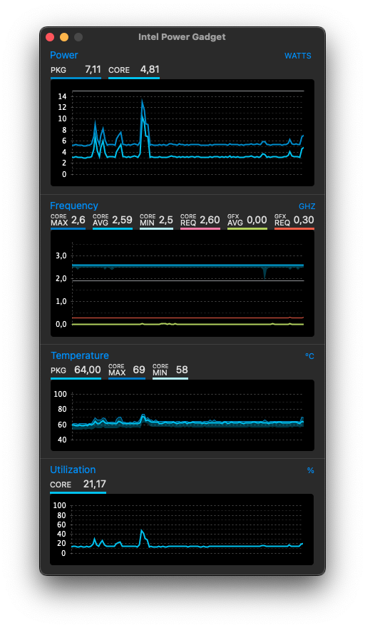
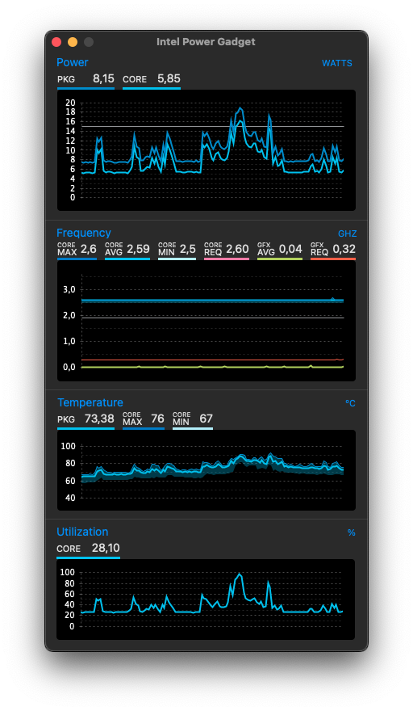
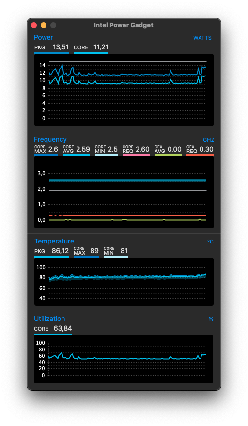
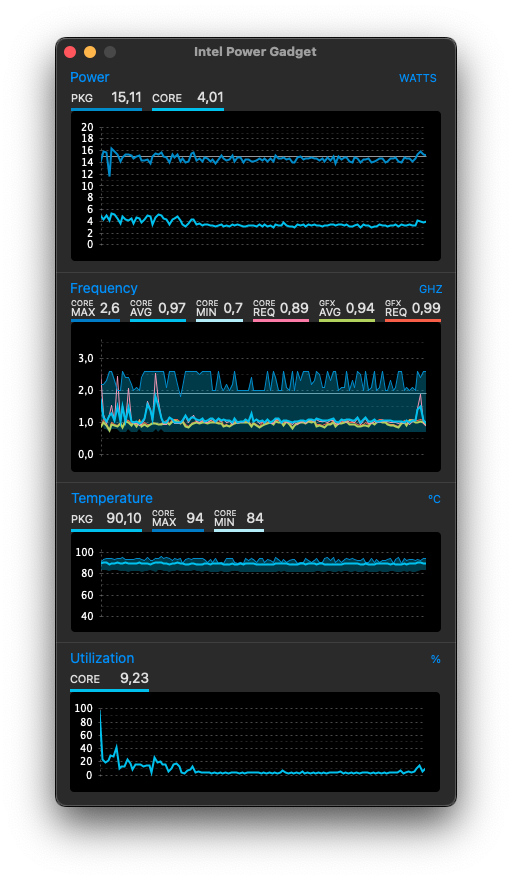

# Lenovo ThinkPad X380 Yoga - OpenCore Configuration


[](https://developer.apple.com/documentation/macos-release-notes)
[](https://developer.apple.com/documentation/macos-release-notes)
[](https://developer.apple.com/documentation/macos-release-notes)
[](https://github.com/acidanthera/OpenCorePkg)
[](https://psref.lenovo.com/syspool/Sys/PDF/ThinkPad/ThinkPad_X380_Yoga/ThinkPad_X380_Yoga_Spec.PDF)
[](https://pcsupport.lenovo.com/us/en/products/laptops-and-netbooks/thinkpad-x-series-laptops/thinkpad-x380-yoga/downloads/driver-list/component?name=BIOS%2FUEFI&id=5AC6A815-321D-440E-8833-B07A93E0428C)
[](/LICENSE)
[](https://github.com/kotakbiasa/ThinkPad-X380-Yoga-Hackintosh-OpenCore/issues)
[](https://github.com/kotakbiasa/ThinkPad-X380-Yoga-Hackintosh-OpenCore)

**DISCLAIMER:**  
This OpenCore EFI works fine on my Thinkpad X380 Yoga.
I am not responsible for any damages you may cause.  
As you embark on your Hackintosh journey you are encouraged to **READ** the entire README and [Dortania](https://dortania.github.io/getting-started/) guides before you start to get an understanding of the install process. It will save many a message instructing you to read the manual. **I am not an expert**, I haven't forced you to do anything, so put on your big boy pants and take responsibility for any mess you get yourself into.

With that said I'm happy to help when/where I can. When you encounter bug or want to improve this repo, consider opening an issue or pull request. You can also find a wealth of knowledge on [Reddit](https://www.reddit.com/r/hackintosh/), [TonyMacX86](https://www.tonymacx86.com) or [Google](https://www.google.com).

## Introduction

<details>  
<summary><strong>Getting started 📖</strong></summary>
</br>

**Meet the Bootloader:**

- [Why OpenCore](https://dortania.github.io/OpenCore-Install-Guide/why-oc.html)
- Dortania's [website](https://dortania.github.io)

**Recommended tools:**

- Plist editor [ProperTree](https://github.com/corpnewt/ProperTree)
- Handy-dandy ESP mounting script [MountEFI](https://github.com/corpnewt/MountEFI)
- Cross-platform GUI management tools for OpenCore [OCAT](https://github.com/ic005k/OCAuxiliaryTools)
- Py script that uses acidanthera's macserial to generate SMBIOS [GenSMBIOS](https://github.com/corpnewt/GenSMBIOS)
- The Swiss army knife of vanilla Hackintoshing [Hackintool](https://github.com/benbaker76/Hackintool)

**Resources**

- [OpenCore](https://github.com/acidanthera/OpenCorePkg)

</details>

## 💻 My Hardware

| Category  | Component                                            | Note                                                         |
| --------- | ---------------------------------------------------- | ------------------------------------------------------------ |
| Type      | 20LH                                                 |                                                              |
| CPU       | Intel(R) Core(TM) i5-8350U CPU @ 1.70GHz             |                                                              |
| GPU       | Intel UHD 620                                        |                                                              |
| SSD       | Lexar NM620 512GB M.2 NVMe SSD                       | Replaced cursed PM 981 which still doesn't work reliably. Read this [Anti-Hackintosh Buyers Guide - Storage](https://dortania.github.io/Anti-Hackintosh-Buyers-Guide/Storage.html)     |
| Screen    | 13.3" FHD 1920x1080                                  | Multi touch and pen* support working                         |
| Memory    | 16GB DDR4 2400Mhz                                    |                                                              |
| Camera    | 720p Camera + IR Camera                              |                                                              |
| Audio     | Conexant® CX8200                                     | I suggest trying several layout ID `3, 15, 21, 23, or 80`    |
| Touchoad  | ELAN v4 LEN2034 PS2 Interace                         |                                                              |
| Wifi & BT | Intel AC 8265 and Bluetooth                          | Use AirportItlwm for your macOS version and enjoy native Wi-Fi control. |
| Ethernet  | Intel I219-LM4 Gigabit Ethernet                      |                                                              | 
| Input     | PS2 Keyboard & I2CHID TrackPad (touchscreen and pen) | I'm using [YogaSMC](https://github.com/zhen-zen/YogaSMC) for media keys. The kext is in the folder but **you'll need to install the app.** |

<details>
<summary><strong>Main software</strong></summary>


| Component    | Version |
| ------------ | ------- |
| macOS Sequoia | 15.1  |
| OpenCore     | v1.0.2  |


</details>

## 📖 Installation

<details>  
<summary><strong>How to install macOS</strong></summary>
</br>

1. [Create an installation media](https://dortania.github.io/OpenCore-Install-Guide/installer-guide/#making-the-installer)
1. Download the [latest EFI folder](https://github.com/simprecicchiani/ThinkPad-T460s-macOS-OpenCore/releases) and copy it into the ESP partiton
1. Change your BIOS settings according to the table below
1. Boot from the USB installer (press `F12` to choose boot volume) and [start the installation process](https://dortania.github.io/OpenCore-Install-Guide/installation/installation-process.html#booting-the-opencore-usb)

| Menu     |                   |                                 | Setting     |
| -------- | ----------------- | ------------------------------- | ----------- |
| Config   | USB               | UEFI BIOS Support               | `Enable`    |
|          | Power             | Intel SpeedStep Technology      | `Enable`    |
|          |                   | CPU Power Management            | `Enable`    |
|          | CPU               | Hyper-Threading Technology      | `Enable`    |
| Security | Security Chip     |                                 | `Disable`   |
|          | Memory Protection | Execution Prevention            | `Enable`    |
|          | Virtualization    | Intel Virtualization Technology | `Enable`    |
|          |                   | Intel VT-d Feature              | `Enable`    |
|          | Anti-Theft        | Computrace                      | `Disable`   |
|          | Secure Boot       |                                 | `Disable`   |
|          | Intel SGX         |                                 | `Disable`   |
|          | Device Guard      |                                 | `Disable`   |
| Startup  | UEFI/Legacy Boot  |                                 | `UEFI Only` |
|          | CSM Support       |                                 | `No`        |
|          | Boot Mode         |                                 | `Quick`     |

</details>

<details>  
<summary><strong>Enable Apple Services</strong></summary>
</br>

1. Run the following script in Terminal

```bash
git clone https://github.com/corpnewt/GenSMBIOS && cd GenSMBIOS && chmod +x GenSMBIOS.command && ./GenSMBIOS.command
```

2. Type `3` to Generate SMBIOS, then press ENTER
3. Type `MacbookPro15,2`, then press ENTER. Leave this Terminal window open.
4. Open `/EFI/OC/Config.plist` with any editor and navigate to `PlatformInfo -> Generic`
5. Add the script's last result to `MLB, SystemSerialNumber and SystemUUID`

```diff
<key>PlatformInfo</key>
<dict>
   <key>Generic</key>
   <array>
      </dict>
         <key>AdviseWindows</key>
         <false/>
         <key>SystemMemoryStatus</key>
         <string>Auto</string>
         <key>MLB</key>
+        <string>M0000000000000001</string>
         <key>ProcessorType</key>
         <integer>0</integer>
         <key>ROM</key>
         <data>ESIzRFVm</data>
         <key>SpoofVendor</key>
         <true/>
         <key>SystemProductName</key>
         <string>MacBookPro16,3</string>
         <key>SystemSerialNumber</key>
+        <string>W00000000001</string>
         <key>SystemUUID</key>
+        <string>00000000-0000-0000-0000-000000000000</string>
      </dict>
   </array>
</dict>
```

6. Save and reboot the system

</details>

## 🧰 Post-install (optional)

## Status

<details>  
<summary><strong>What's working ✅</strong></summary>
</br>

- [x] Intel HD 620 Graphics `incuding graphics acceleration`
- [x] Battery management
- [x] USB ports
- [x] Internal camera `working fine on FaceTime, Skype, Zoom and others`
- [x] Sleep / Wake / Shutdown / Reboot
- [X] Intel WiFi & Bluetooth (thanks to [itlwn](https://github.com/OpenIntelWireless/itlwm) & [Heliport](https://github.com/OpenIntelWireless/HeliPort) )
- [x] iMessage, FaceTime, App Store, iTunes Store `Please generate your own SMBIOS`
- [x] Speakers and headphones combo jack
- [x] Microphone
- [x] Keyboard map and hotkeys with [YogaSMC](https://github.com/zhen-zen/YogaSMC)
- [x] Multi-Touch Screen `Touchscreen just feel more natural than using Touchpad (Touchpad gesture enabled). Pen also working`
- [x] SIP and FileVault 2 can be turned on
- [x] Micro SD Card Reader `slow r/w speed but works`

</details>

<details>  
<summary><strong>What's not working ⚠️</strong></summary>
</br>

- [ ] Safari DRM `Use Chromium engine to watch Apple TV+, Amazon Prime Video, Netflix and others`
- [ ] Fingerprint reader - `No. Don't expect macOS driver any time soon.`
- [ ] Samsung PM 981 NVME drive - `Still unstable. Could work for some, not for others. See `[Anti-Hackintosh Buyers Guide - Storage](https://dortania.github.io/Anti-Hackintosh-Buyers-Guide/Storage.html)
- [ ] Sidecar Wireless `doesn't work without apple native WIFI card`

</details>

<details>  
<summary><strong>Not tested 🔄</strong></summary>
</br>

- [ ] Apple Watch Unlock
- [ ] WWAN
- [ ] AirDrop
- [ ] HDMI
- [ ] Thunderbolt

</details>

## Performance

<details>  
<summary><strong>Power consumption and thermals 🔥</strong></summary>
</br>

| Idle State                     | Max Frequency                  | 2 Thread Frequency             | All Thread Frequency           | GPU Max Frequency              |
| ------------------------------ | ------------------------------ | ------------------------------ | ------------------------------ | ------------------------------ |
|  |  |  |  |  |

</details>

<details>  
<summary><strong>Benchmarks ⏱</strong></summary>
</br>

| CPU         | Single-Core | Multi-Core |
| :---------- | ----------: | ---------: |
| Geekbench 5 |         686 |       2810 |
| **GPU**     |  **OpenCL** |  **Metal** |
| Geekbench 5 |        4351 |       4051 |

<small>macOS Seqoia 15.1, EFI release 1.0.2, CPU:i5-8350u</small>
</details>

## Credits:
- [Apple](https://apple.com) for macOS.
- [Acidanthera](https://github.com/acidanthera) for OpenCore, Kexts and maciASL
- [CorpNewt](https://github.com/corpnewt) for ProperTree, CPUFriendFriend and SSDTTime
- [Dortania](https://dortania.github.io/OpenCore-Install-Guide/) For great and detailed guides.
- [ic005k](https://github.com/ic005k/OCAuxiliaryTools) for OpenCore Auxiliary Tools
- [benbaker76](https://github.com/benbaker76/Hackintool) for Hackintool
- [zhen-zen](https://github.com/zhen-zen/YogaSMC) for YogaSMC
- [r/hackintosh](https://www.reddit.com/r/hackintosh/)
